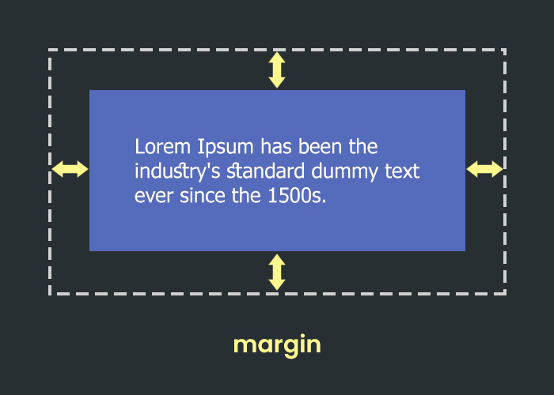
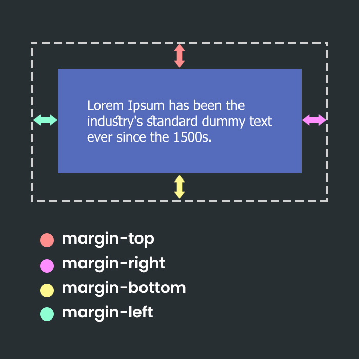
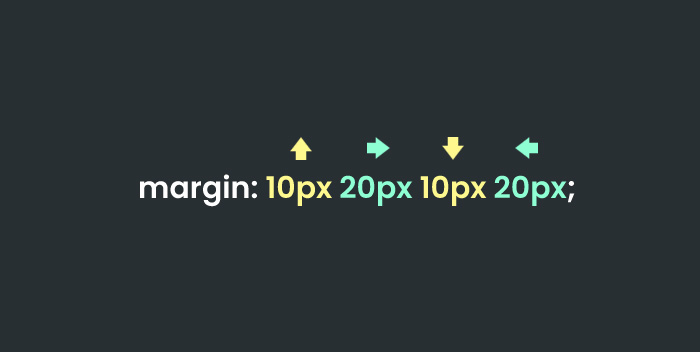
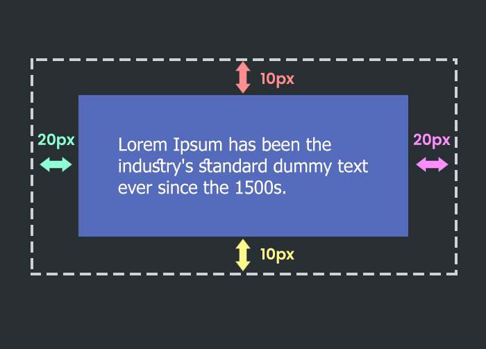
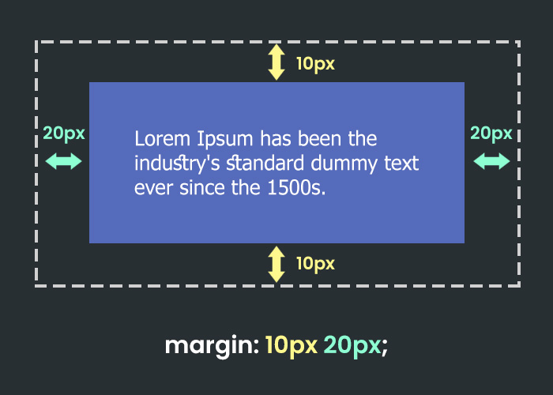
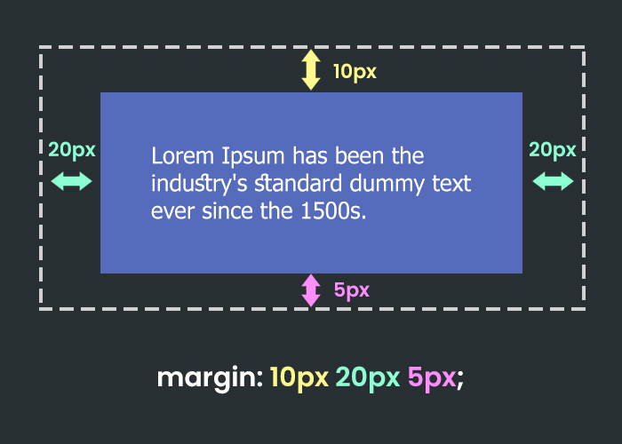

لا تختلف الخاصية `margin` عن الخاصية `padding` بشكل كبير، خلال هذا الدرس ستتعرف على أهمية هذه الخاصية وكيف نستطيع إستخدامها.


## الخاصية `margin`:

هذه الخاصية هي المسؤولة عن إعطاء العناصر هوامش من جميع الإتجاهات.

 

بالإمكان كذلك ضبط الهوامش فرادى باستخدام الخواص:

```
margin-top
margin-right
margin-bottom
margin-left
```

كما موضح بالصورة التالية:

 

ما تعلمناه في درس الخاصية `padding` ينطبق على هذه الخاصية إيضاً فبإمكاننا إعطاء الفقرة النصية الهوامش أدناة بالطريقتين، إما بإستخدام الخاصية الخاصة بكل جهة كما يلي:

```
p{
margin-top: 10px;
margin-right: 20px;
margin-bottom: 10px;
margin-left: 20px;
}
```

أو بإستخدام الإختصار `margin` كما في التالي:

```
p{
margin: 10px 20px 10px 20px;
}
```

بحيث سيتم تطبيقها بالشكل التالي:
 

تذكر دائماً عند إستخدامك للإختصار فالقيمة الأولى هي قيمة الهامش من اعلى والثانية قيمة الهامش من اليمين يليها القيمة الثالثة للهامش من الأسفل وأخيراً قيمة الهامش من اليسار، كما بالصورة التالية:

 

**هل تذكر عندما قلنا بأننا المطورين نحرص دائماً على عدم تكرار أنفسنا وتحقيق النتيجة بأقل عدد ممكن من الأحرف والأسطر؟**

دعنا نلقي نظره على الكود الذي قمنا بكتابته في الصورة أعلاة وبالرغم من اننا سبق وقمنا بإستخدامه لإختصار الأربعة الأكواد إلى كود واحد كالتالي :

```
margin: 10px 20px 10px 20px;
```


**هل تلاحظ اي شئ تكرر في هذا الكود أكثر من مرة؟**

اذا كنت قد لاحظت اننا قمنا بتكرار القيمة`10px` و القيمة `20px` مرتين، فذلك شئ رائع!

السؤال الأن كيف بإمكاننا أن نكون أكثر إحترافية بإعادة كتابة هذا الكود بدون أي تكرار 

 

لنقم بتحليل ما قمنا به اولاً حتى نحاول إيجاد شئ مشترك بين القيم المتكرر:

1- قمنا بإعطاء الصندوق هامش  من الأعلى والأسفل بقيمة `10px`
2- قمنا بإعطاء الصندوق هامش من اليمين واليسار بقيمة `20px`

**س: هل تلاحظ ان هناك علاقة بين الإتجاة أعلى وأسفل؟**

ج: كلاً منهما هو الإتجاة المضاد للأخر، اليس كذلك؟

**ماذا عن العلاقة بين الإتجاة يمين ويسار ؟**

أيضاً كلاً منهما هو الإتجاة المضاد للأخر.

جميل اذا دعني أخبرك بأن الخاصية `margin` تقول لنا اذا كانت الإتجاهات المتضادة تأخذ نفس القيمة فلا داعي لتكرار القيمة مرتين، وإنما قم بكتابتها مرة واحدة لكل إتجاهين بالشكل التالي:

```
margin: 10px 20px;
```

في الكود أعلاة قمنا بإعطاء الخاصية `margin` قيمتين فقط، وبمجرد ما نقم بذلك سيفهم المتصفح بأننا نريد إعطاء الصندوق التالي:

1-  هامش من اعلى واسفل بقيمة `10px`
2- هامش من اليمين واليسار بقيمة `20px`

بمعنى ان القيمة الأولى سيتم إعطائها للإتجهات العمودية والثانية للإتجاهات الأفقية، كما بالصورة التالية:

 

برأيك ما الذي سيحصل للصندوق عندما نقوم بإعطائه الخاصية بالشكل التالي:

```
margin: 20px 10px;
```

أي اتجاهين ستحصل على القيمة `20px` واي منهما سيحصل على القيمة `10px`، قم بالتفكير بها ومن ثم قم بتجربتها في بيئة العمل بالفيديو أعلاة.

---


لنفترض أنك تريد أن تقوم بإعطاء الصندوق الهوامش التالية:

1- هامش من الأعلى بقيمة `10px`
2- هامش من اليمين بقيمة `20px`
3- هامش من الأسفل بقيمة `5px`
4- هامش من اليسار بقيمة `20px`

لنقم بكتابة الكود بالخاصية المختصرة `margin` كالتالي:

```
p{
margin: 10px 20px 5px 20px;
}
```

كما لاحظت قمنا بتكرار القيمة للإتجاهين اليمين واليسار بينما هناك قيمة مختلفة لكل من الإتجاهين أعلى وأسفل، في هذه الحالة لا يمكننا إستخدام إختصار الخاصية `margin` بقيمتين فقط، فلدينا ثلاث قيم مختلفة وهي : `10px` `20px` `5px`.

ولكن نستطيع وضع هذه الثلاث القيم بالشكل التالي:

```
p{
margin: 10px 20px 5px;
}
```

وسيقوم متصفح الإنترنت بإعتبار القيمة التي بالوسط الـ `20px` قيمة الهامش للجهتين اليمين واليسار كما بالصورة التالية:

 

الحالة الأخيرة التي يتاح لنا فيها إختصار عدد القيم هي أن يكون جميع الإتجاهات لديها نفس القيمة كالتالي:

```
p{
margin: 10px;
}
```

ما عدا ذلك فأنت مجبر بأن تقوم بتحديد الأربع القيم الخاصة بكل إتجاة.

---

للإشارة كل ما تطرقنا إليه في هذا الدرس ينطبق على الخاصية `padding` كذلك.


