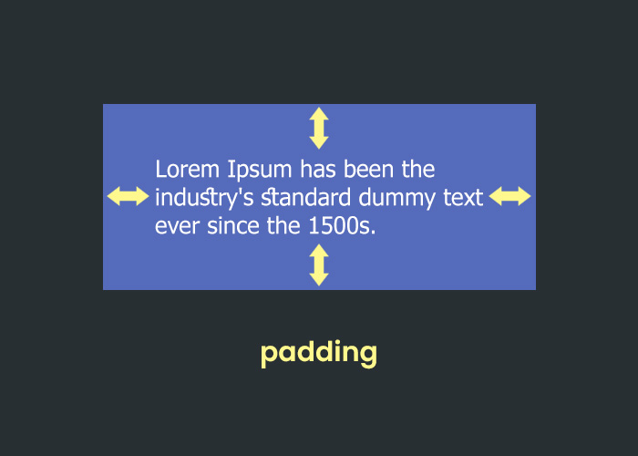
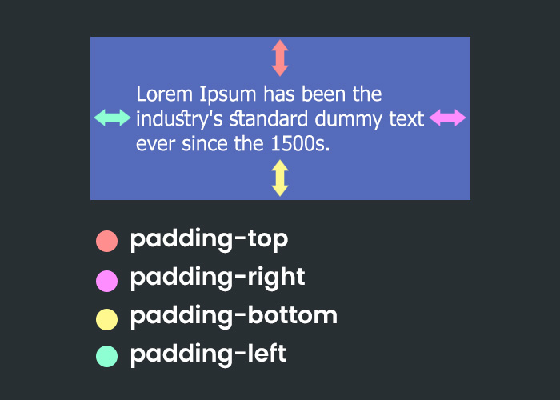
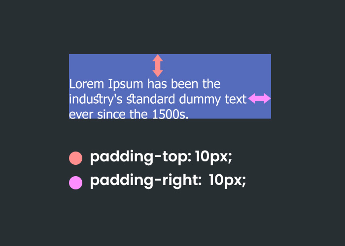
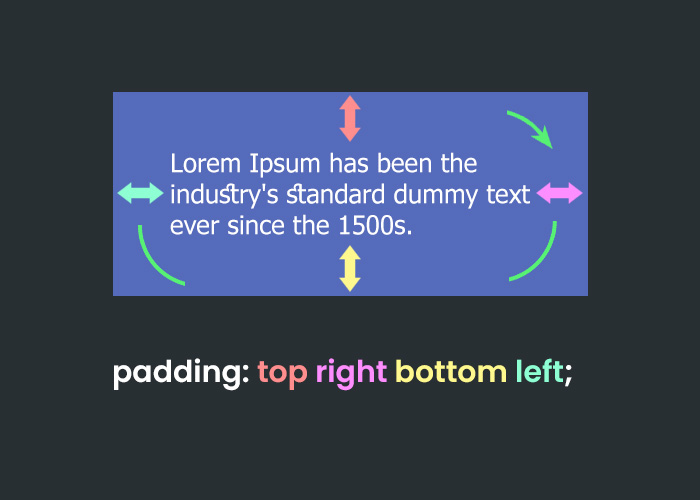
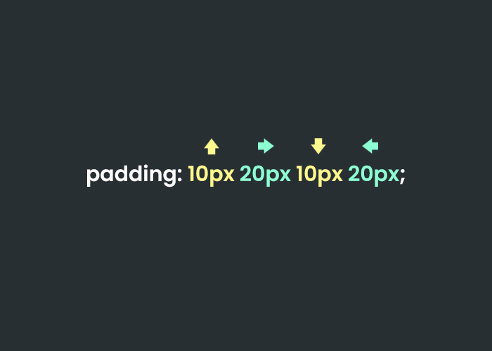

الخاصية `padding` هي الخاصية المسؤولة عن إعطاء العناصر حاشية من جميع الأطراف. 

  

بالإمكان كذلك ضبط الحواشي فرادى باستخدام الخواص 

    padding-top

    padding-right

    padding-bottom

    padding-left

  

فعلى سبيل المثال لإعطاء فقرة نصية حاشية من اعلى ومن اليمين بقيمة `10px` نقوم بالتالي:

```
p{
    padding-top: 10px;
    padding-right: 10px;
}
```

**النتيجة:**

  


### جميل، ماذا عن إعطاء الفقرة النصية التالي:

1- حاشية من اعلى بقيمة `10px`
2- حاشية من اليمين بقيمة `20px`
3- حاشية من الأسفل بقيمة `10px`
4- حاشية من اليسار بقيمة `20px`

**كيف بإمكانك القيام بذلك!**

تستطيع القيام بذلك بإستخدام الكود التالي، اليس كذلك؟

```
p{
    padding-top: 10px;
    padding-right: 20px;
    padding-bottom: 10px;
    padding-left: 20px;
}
```

نعم، صحيح بإمكاننا القيام بذلك :clap:

لكن تطبيق ذلك بإستخدام أربعة أسطر هي طريقة المبتدئين 

  

 أنت لم تعد مبتدأ لنقم بتقليص عدد الأسطر، وإختصارها بطريقة المحترفين :sunglasses:

 

بإمكاننا إختصار تلك الاربعة الأسطر إلى سطر واحد وإستخدام الخاصية `padding` لإضافة حاشية من جميع الجهات، إطلع على الصورة التالية:

  

سنقوم بكتابة الخاصية `padding` ومن ثم سنقوم بتحديد القيم لكل إتجاة، ابتدأ من الاعلى ثم اليمين ثم الاسفل ثم اليسار (نبدأ من الأعلى ونمر على بقية الإتجاهات مع إتجاة عقارب الساعة).

كالتالي:

```
p{
    padding: 10px 20px 10px 20px;
}
```

الصورة التالية توضح الكود وفي اعلى كل قيمة سهم يحدد الإتجاة الذي سيتم تطبيق هذه الحاشية عليه.

  

رائع، أصبح لدينا سطر واحد بدلاً من اربعة أسطر.

### هل ما يزال بإمكاننا أن ننقل هذا الكود لمستوى اكثر إحترافية؟

سنكتشف ذلك خلال الدروس القادمة في هذه الوحدة