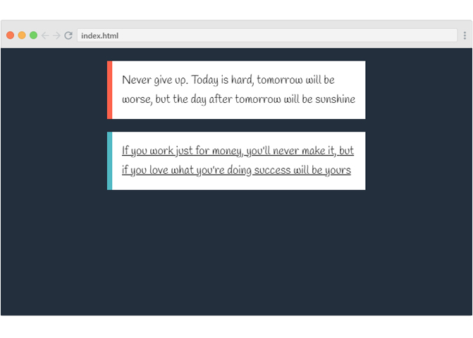

## المهمة:

قمت في المهمة السابقة بالتدرب على تنسيقات النصوص وإضافة بعض التنسيقات للفقرات النصية في صفحة الويب، في هذه المهمة سنقوم بالتدرب على نموذج الصندوق box model ونأخذ الصفحة التي قمنا بالعمل عليها إلى مستوى أخر.

تطبيقي على المهمة السابقة:

  

## ماهو المطلوب في هذه المهمة؟

ستقوم بالرجوع لبيئة العمل السابقة وإكمال العمل على تنسيق صفحة الويب بحيث ستقوم بتطبيق الخصائص التي تعلمتها خلال وحدة نموذج الصندوق كالهوامش، الحاشية والحدود وما خلافة.

**تطبيقي على هذه المهمة كالتالي:**

  

حيث قمت بعمل بعض التعديلات على التنسيقات السابقة كالالوان، حجم الخط ومحاذاته..

 وبعد ذلك قمت بإعطاء الفقرات النصية حد من جهة اليسار، وإضافة بعض الهوامش من الاعلى والاسفل بالإضافة إلى توسيط صناديق الفقرات في منتصف الصفحة..

ولم أنسى إضافة الخاصية التي ستقوم بالتأكد من أن الحاشية والحدود لن تزيد من عرض الصندوق وإنما سيتم إحتسابها من أصل العرض الأصلي..

**الأن يأتي دورك لتقم بنقل صفحتك إلى مستوى أعلى :wink:**

بعد إنتهائك من العمل على تنسيق صفحة الويب شارك معنا الأكواد التي قمت بكتابتها ويستحسن أن تقوم بإرفاق صورة للنتيجة النهائية كذلك.

## أين تقوم بكتابة الأكواد؟

ستقوم بإكمال العمل على بيئة العمل السابقة قم بالضغط على الزر أدناة للتوجة إليها.

<a href="https://coretabs.net/classroom/frontend/البدء-مع-لغة-تنسيقات-المواقع-css/البدأية-مع-لغة-التنسيقات-CSS/بيئة-عمل-مهمة-التدرب-على-لغة-التنسيقات" class="task-btn">بيئة العمل</a>

## كيف تقوم بمشاركة الكود؟

قم بمشاركة الأكواد ويستحسن إرفاق صورة للنتيجة النهائية في منصة المجتمع على الرابط التالي

<a href="https://forums.coretabs.net/t/مشاركة-حلول-التدرب-على-نموذج-الصندوق/1380" style="display: block; width: 200px; background-color: #5355e8; background-image:linear-gradient(to left, #2d43e7, #9042e8); color:#fff; padding: 10px; margin: 30px auto; border-radius:100px; text-decoration: none; font-size: 18px; text-align: center;" target="_blank">مشاركة الكود</a>

---

في حال واجهتك مشكلة او تحتاج إلى أي مساعدة بإمكانك الرجوع دائماً لمنصة مجتمعنا [من هنا](https://forums.coretabs.net.) وستجدنا جميعاً مستعدين لمساعدتك!