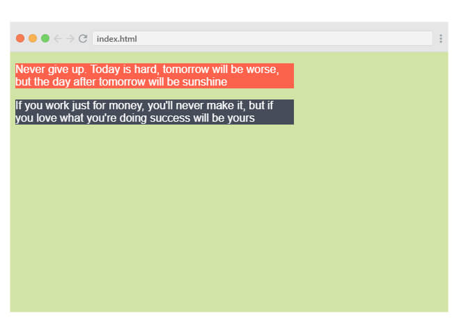
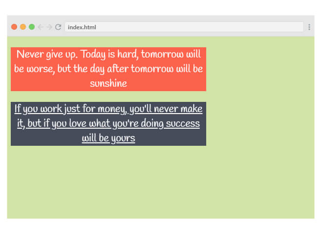

## المهمة:

كنت قد قمت في المهمة السابقة بالعمل على إضافة بعض التنسيقات لصفحة ويب وقمت بمشاركة الأكواد التي قمت بكتابتها معنا في منصة المجتمع، بعد أن تم مراجعة أكوادك من قبلي أو من قبل احد الموجهين بإمكانك البدء بالعمل على هذه المهمة.

تطبيقي على المهمة السابقة:
 

## ماهو المطلوب؟
ستقوم بالرجوع لبيئة العمل السابقة وإكمال العمل على تنسيق صفحة الويب من حيث توقفت بحيث ستقوم بتطبيق الخصائص التي تعلمتها خلال وحدة تنسيقات النصوص.

**باب الإبداع مفتوح بتطبيق الخواص التي تريد على الفقرات النصية**. بالنسبة لتطبيقي على هذه المهمة فهو كالتالي:
 

حيث قمت بتغيير نوع الخط بإستخدام خدمة [google fonts](https://fonts.google.com) وإضافة بعض التنسيقات الأخرى على النصوص كحجم الخط ومحاذاته وما خلافة...

بعد إنتهائك من العمل على تنسيق صفحة الويب شارك معنا الأكواد التي قمت بكتابتها ويستحسن أن تقوم بإرفاق صورة للنتيجة النهائية كذلك.

## أين تقوم بكتابة الأكواد؟

ستقوم بإكمال العمل على بيئة العمل السابقة قم بالضغط على الزر أدناة للتوجة إليها.

<a href="https://coretabs.net/classroom/frontend/البدء-مع-لغة-تنسيقات-المواقع-css/البدأية-مع-لغة-التنسيقات-CSS/بيئة-عمل-مهمة-التدرب-على-لغة-التنسيقات" class="task-btn">بيئة العمل</a>

## كيف تقوم بمشاركة الكود؟

قم بمشاركة الأكواد ويستحسن إرفاق صورة للنتيجة النهائية في منصة المجتمع على الرابط التالي

<a href="https://forums.coretabs.net/t/مشاركة-حلول-مهمة-التدرب-على-تنسيقات-النصوص/1378" style="display: block; width: 200px; background-color: #5355e8; background-image:linear-gradient(to left, #2d43e7, #9042e8); color:#fff; padding: 10px; margin: 30px auto; border-radius:100px; text-decoration: none; font-size: 18px; text-align: center;" target="_blank">مشاركة الكود</a>

---

في حال واجهتك مشكلة او تحتاج إلى أي مساعدة بإمكانك الرجوع دائماً لمنصة مجتمعنا [من هنا](https://forums.coretabs.net.) وستجدنا جميعاً مستعدين لمساعدتك!