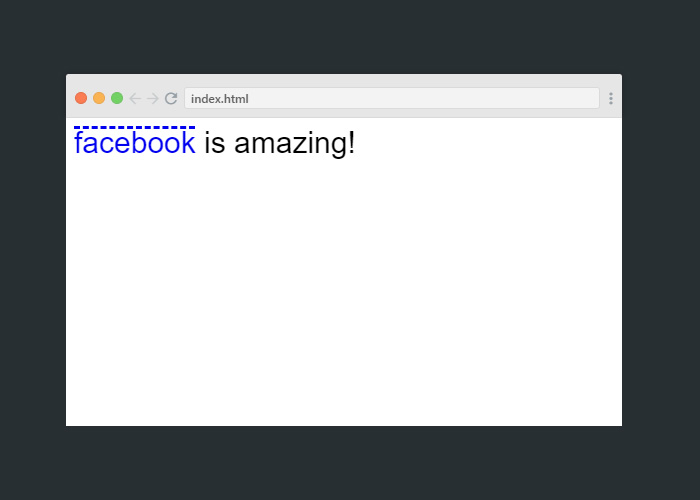
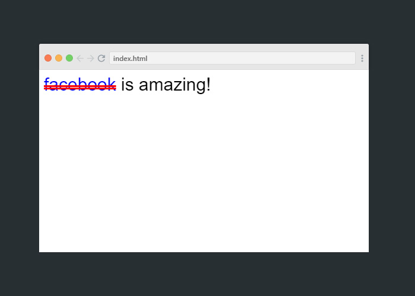
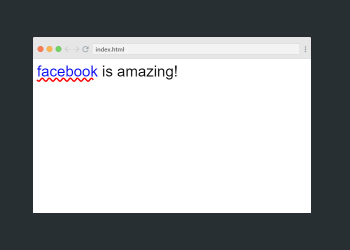

الخاصية `text-decoration` تحدد شكل خطوط الزخرفة للنصوص.

تطرقنا في الفيديو إلى نوع واحد من القيم التي بإلامكان إسنادها لهذه الخاصية ففي الحقيقة هذه الخاصية تعتبر إختصار لأكثر من خاصية بآنٍ واحد وتتضمن الخواص التالية:

### الخاصية `text-decoration-line`:

هذه الخاصية نقوم بتحديد نوع خط الزخرفة وتقبل القيم التالية:

|القيمة|الشرح|
|---|---|
|none|  عدم وضع أي خط زخرفة للنص|
|underline| خط الزخرفة تحت النص|
|overline|  خط الزخرفة فوق النص|
|line-through| خط الزخرفة من خلال النص|

### مثال:
```
a{
    text-decoration-line: line-through;
}
```

 

---
### الخاصية `text-decoration-style`:

هذه الخاصية تقوم بنحديد شكل خطوط الزخرفة وتقبل القيم التالية:

|القيمة|الشرح|
|---|---|
|solid| وهي القيمة الافتراضية للخط الغامق|
|double| خط الزخرفة مزدوج|
|dashed| خط زخرفة متقطع|
|wavy| خط الزخرفة مموج|

### مثال:
```
a{
    text-decoration-line: overline;
    text-decoration-style: dashed;
}
```

 


---

### الخاصية `text-decoration-color`:

هذه الخاصية تقوم بتحديد لون خط الزخرفة وتقبل القيم الخاصة بالإلوان.

### مثال:
```
a{
    text-decoration-line: line-through;
    text-decoration-style: double;
    text-decoration-color: red;
}
```

 


---

## إستخدام الإختصار:

بإمكانك إستخدام الثلاث الخواص اعلاة للوصول للشكل المطلوب او بإمكانك إستخدم كود واحد مختصر كالتالي:

```
a{
    text-decoration: underline wavy red;
}
```

 


