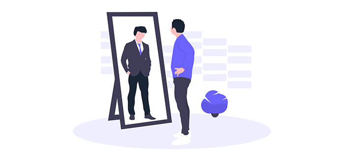
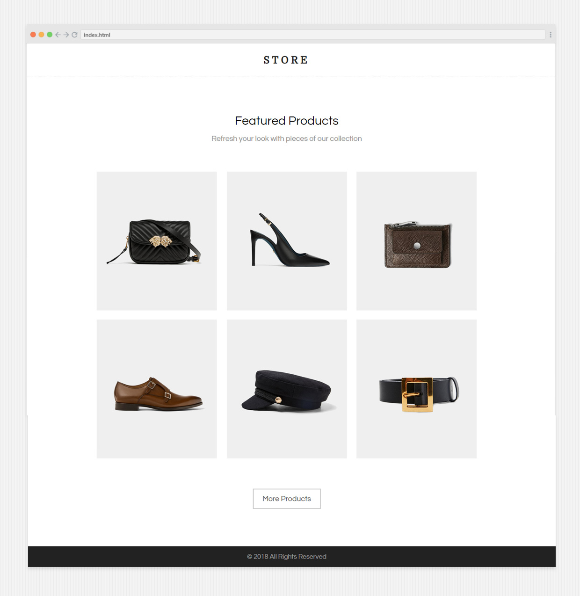

 

**تهانينا** :confetti_ball:، إنتهيت من ورشة العمل الأولى وتعرفت خلالها على التالي:

- إمكانياتك كمطور ويب.
- أساسيات لغة الهيكلة HTML والعديد من العناصر الهامة.
- أساسيات لغة التنسيقات CSS والعديد من الخواص الهامة.
- ربط  صفحات الويب ببعضها البعض.
- رفع مشاريعك على منصة Github وكيفة إطلاقها على شبكة الإنترنت.

### تطبيقات الورشة
خلال هذه الورشة قمت ببناء تطبيقين قمت من خلالهما بتطبيق ما تعلمتة خلال هذه الورشة، حيث كان تطبيقنا الأساسي هو صفحة المتجر الإلكتروني وكانت النتيجة النهائية له كالتالي:

 

كانت هذه أبسط صورة ممكنة لمتجرنا الإلكتروني، لكن هل تعتقد بأن هذا كل شئ؟

بالتأكيد لا، فسوف نعود لإكمال العمل عليه خلال الورشات القادمة وفي النهاية سنخرج بمتجر متكامل بالعديد من المميزات.