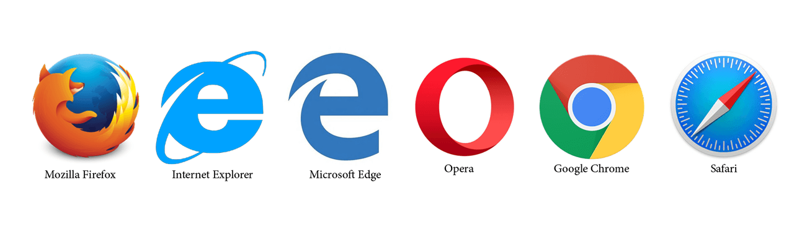
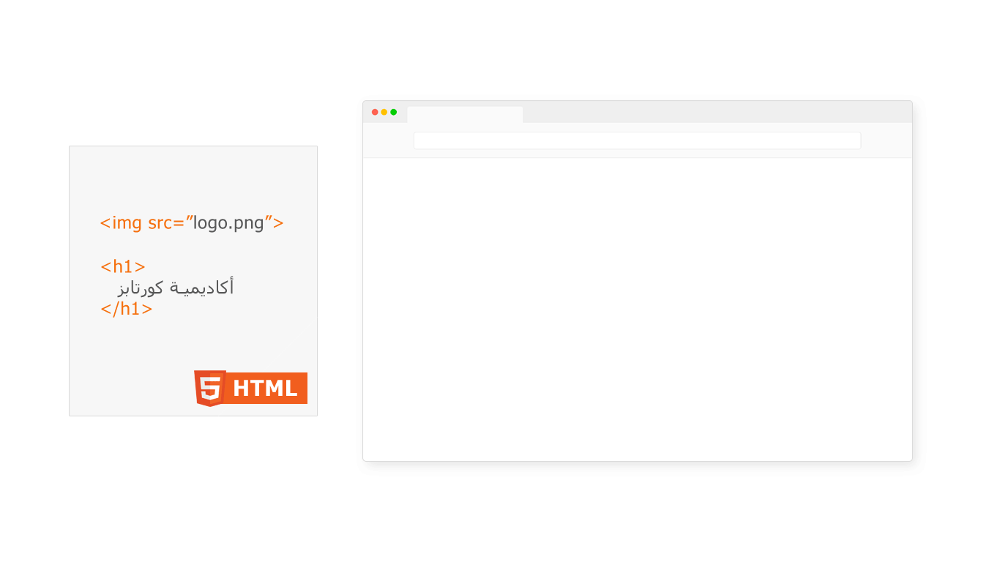

### ماهو متصفح الإنترنت؟
متصفح الإنترنت هو برنامج يستخدم للوصول للمواقع الإلكترونية، حيث يتيح لك عرض صفحات الويب والتفاعل معها.

 
الصورة أعلاة لأشهر متصفحات الإنترنت 

---

### ماهو دور متصفح الإنترنت؟
أهم دور رئيسي لمتصفح الإنترنت هو عمل تحليل (parse) لأكواد لغة الـ HTML والـ CSS  وعرض المحتويات كالنصوص والصور وغيرها من العناصر على الشاشة.

 **الصورة التالية لتبسيط فكرة تحليل أكواد لغة HTML وكيف تبدوا النتيجة على المتصفح**

 

**الصورة التالية لتبسيط فكرة إضافة التنسيقات بلغة CSS على عناصر الـ HTML التي تم إضافتها سابقاً**

 