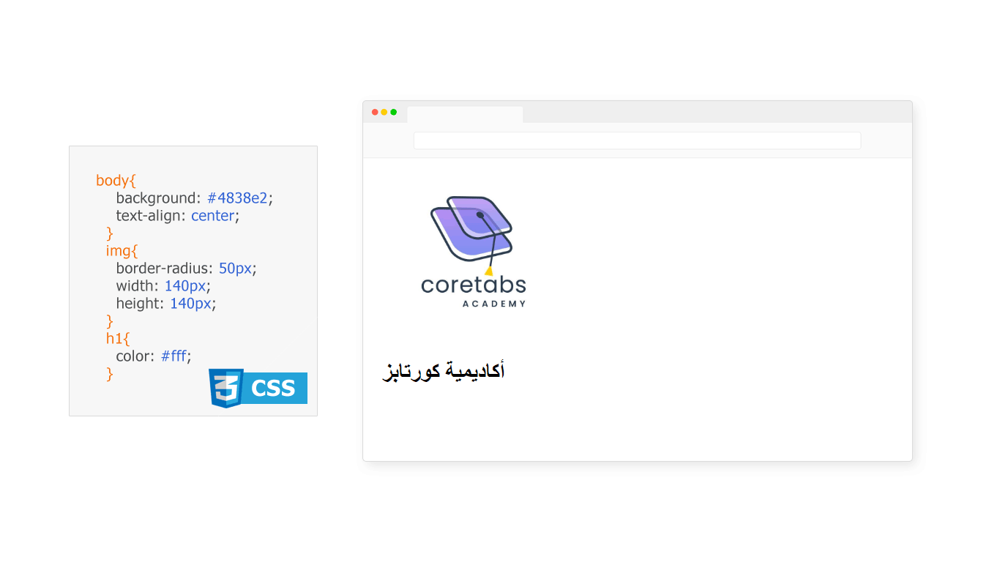

### ماهو متصفح الإنترنت؟
متصفح الإنترنت هو برنامج يستخدم للوصول للمواقع الإلكترونية، حيث يتيح لك عرض صفحات الويب والتفاعل معها.

 

---

### ماهو دور متصفح الإنترنت؟
أهم دور رئيسي لمتصفح الإنترنت هو عمل تحليل (parse) لأكواد لغة الـ HTML والـ CSS  وعرض المحتويات كالنصوص والصور وغيرها من العناصر على الشاشة.

**للتبسيط:**

يقوم المتصفح بأخذ أكواد لغة الـ HTML وتحليلها ليتم عرض العناصر المطلوبة على الشاشة بإمكانك تصور ذلك كما بالصورة التالية:

 

في حال تم تحديد بعض التنسيقات لتلك العناصر فسيقوم المتصفح بأخذ أكواد الـ CSS وتطبيقها على العناصر كما بالصورة التالية:

 
