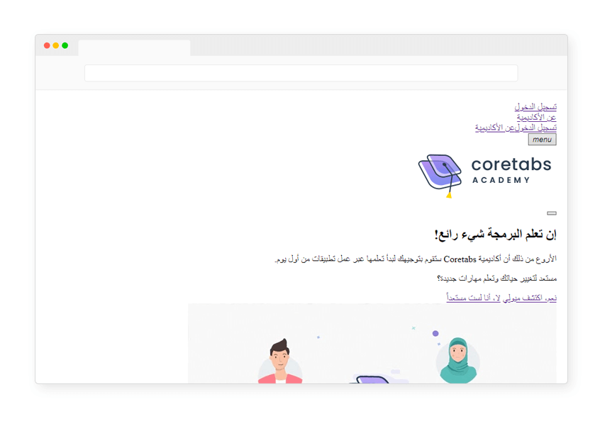
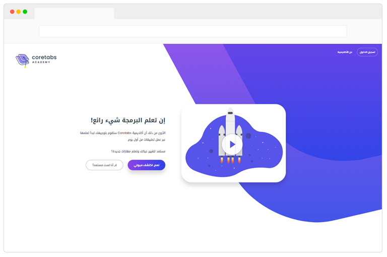

قبل أن تبدأ في تعلم أي لغة جديدة يجب عليك أولاً أن تعرف لماذا تحتاج إليها وما دورها حتى تستطيع البدء ولديك رؤية وأضحة مما قد يسهل عليك دراستها.

### ما هي لغة HTML؟

هي إختصار لـ HyperText Markup Language وترجمتها الحرفية "لغة ترميز النص التشعبي".

### هل HTML  لغة برمجيّة؟

لا، ليست لغة برمجية وإنما لغة ترميز أو نستطيع القول بأنها لغة وصفيّة (Markup language).

### ماذا نعني بأنها لغة وصفيّة؟

أي أننا بإستخدام لغة HTML نقوم بوصف طريقة عرض محتويات صفحة الويب وتحديد العناصر التي نريد إضافتها لموقعنا الإلكتروني كالعناوين الرئيسية، الفقرات النصية، الصور، الروابط وغيرها من العناصر الأخرى.

---

### ما هي لغة CSS؟

هي إختصار لـ Cascading Style Sheets وترجمتها الحرفية "صفحات الأنماط الانسيابية".

### هل CSS  لغة برمجيّة؟

لا، ليست لغة برمجيّة وإنما لغة أنماط (Style sheet language).

### ماذا نعني بأنها لغة إنماط؟

أي أننا بإستخدام لغة CSS نقوم بالتحكم بشكل الموقع و بتنسيقات العناصر التي قمنا بإضافتها للصفحة، كتغيير لون وحجم الخط في الموقع أو إعطاء الصفحة لون خلفية معين وغيرها من التنسيقات الأخرى.

---

### ماهي العلاقة بين لغتي الـ HTML و الـ CSS؟

نستنتج بأنهما يكمّلان بعضهما البعض حيث أن لغة HTML هي المسؤولة عن هيكلة الموقع، بينما لغة CSS هي المسؤولة عن تصميم وتنسيق هذه الهيكلة.

 

الصورة من قبل [jjjjjohn](https://giphy.com/jjjjjohn)

---

### كيف يبدو موقع الأكاديمية بلغة الهيكلة HTML فقط؟

نلاحظ في الصورة التالية كيف أن واجهة الموقع تحتوي على جميع العناصر المطلوبة لكنها غير مرتبة وتفتقر للتنسيقات

 

---

### كيف يبدو موقع الأكاديمية بلغة الهيكلة HTML + لغة التنسيقات CSS؟

نلاحظ في الصورة التالية كيف أن واجهة الموقع أصبحت مرتبة وأكثر جمالية بعد أن تم إضافة تنسيقات لتلك العناصر

 

