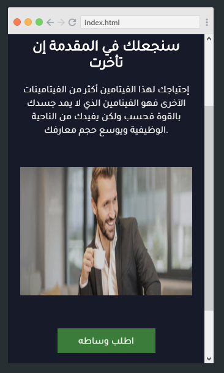
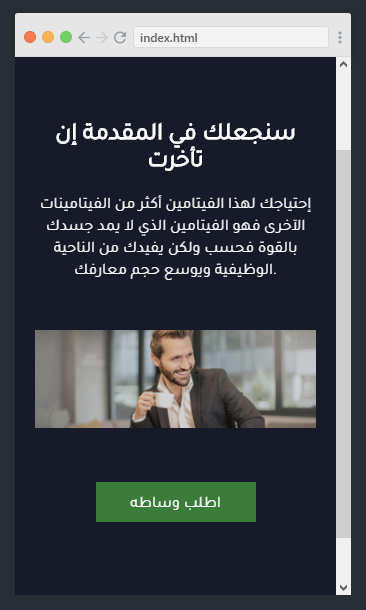

## متطلبات هذه المهمة:

يجب أن تكون قد إنتهيت من [المهمة السابقة](https://coretabs.net/classroom/frontend/html-css-basics/العمل-على-تنسيقات-المشروع/مهمة-تنسيقات-موقع-فيتامين-واو) بإكمال العمل على تنسيقات موقع **فيتامين واو**.

## ماهو المطلوب في هذه المهمة؟

سنقوم في هذه المهمة بجعل الموقع متوافق مع أجهزة الموبايل ونضيف بعض تأثيرات الـ hover للعناصر.

**المتطلبات:**

1- إضافة كود الـ meat viewport لصفحة الويب
```
<meta name="viewport" content="width=device-width, initial-scale=1.0">
```

2- إضافة تأثيرات hover على زر "أطلب وساطة"
 
بإمكانك وضع التنسيقات التي ترغب بها عند مرور الماوس على الزر، على سبيل المثال انا قمت بتغيير لون خلفية الزر والعرض (width) كما بالصورة التالية.


> بإمكانك تطبيق تأثيرات على العناصر الأخرى عند مرور الماوس عليها كيف ما تشاء، باب الإبداع مفتوح

---

## تحدي

سنقوم بعمل تحدي في هذه المهمة ونرى من سيستطيع القيام به :muscle:.

**ماهي المشكلة التي نواجهها؟**
في الوقت الحالي الصورة التي في الصفحة لديها عرض ثابت بقيمة 600px وعندما يتم تصغير نافذة المتصفح او فتح الموقع من خلال الموبايل قد يظهر شريط التمرير في الصفحة. **كما بالصورة التالية:**


**ماهو التصرف المرغوب؟**
نريد من حجم الصورة بأن يكون مرن بحيث عندما يكون حجم النافذة صغير يتم تصغيرها بما يتناسب مع عرض الشاشة. **كما بالصورة التالية:**


**ماهو الحل؟**
قم بالتفكير بطريقة حل هذه المشكلة.

سأعطيك تلميح بأن الحل سيكون في إعطاء الصورة هذه الخاصيتين `width` و الخاصية `max-width`

لكن ماهي القيم التي سنقوم بإعطائها لكل خاصية، هذا هو التحدي الذي أريد منك أن تتجاوزة، قم بالمحاولة ولا تتردد بطرح تساؤلاتك وتجاربك معنا في [منصة المجتمع](https://forums.coretabs.net) لحتى تصل لحل هذه المشكلة.

**مشكلة ستواجهك**
عندما تنجح بجعل الصورة مرنة بما يتناسب مع عرض النافذة ستواجة المشكلة التالية:

سيتم تصغير عرض الصورة بينما يظل الإرتفاع الخاص بها ثابت بالقيمة التي قمت بتحديدها مسبقاً ما سيسبب تشوة في الصورة كالتالي:



قم بعمل التغييرات التي تراها لازمة لجعل إرتفاع الصورة يتناسب مع عرضها الجديد في كل مرة.

**بحيث تبدو في النهاية بالشكل التالي:**



**حسناً، الأن يأتي دورك لتقم بالبدء بالعمل :wink:**

## أين تقوم بكتابة الأكواد؟

ستقوم بإكمال العمل على بيئة العمل السابقة قم بالضغط على الزر أدناة للتوجة إليها.

<a href="https://coretabs.net/classroom/frontend/html-css-basics/البدأية-مع-لغة-التنسيقات-CSS/بيئة-عمل-مهمة-التدرب-على-لغة-التنسيقات" style="display: block; width: 200px; background-color: #5355e8; background-image:linear-gradient(to left, #2d43e7, #9042e8); color:#fff; padding: 10px; margin: 30px auto; border-radius:100px; text-decoration: none; font-size: 18px; text-align: center;" target="_blank">بيئة العمل</a>

## كيف تقوم بمشاركة الكود؟

قم بمشاركة الأكواد في منصة المجتمع على الرابط التالي

<a href="https://forums.coretabs.net/t/مشاركة-حلول-مهمة-اللمسات-الأخيرة-على-تطبيق-فيتامين-واو/1383" style="display: block; width: 200px; background-color: #5355e8; background-image:linear-gradient(to left, #2d43e7, #9042e8); color:#fff; padding: 10px; margin: 30px auto; border-radius:100px; text-decoration: none; font-size: 18px; text-align: center;" target="_blank">مشاركة الكود</a>

---

في حال واجهتك مشكلة او تحتاج إلى أي مساعدة بإمكانك الرجوع دائماً لمنصة مجتمعنا [من هنا](https://forums.coretabs.net.) وستجدنا جميعاً مستعدين لمساعدتك!