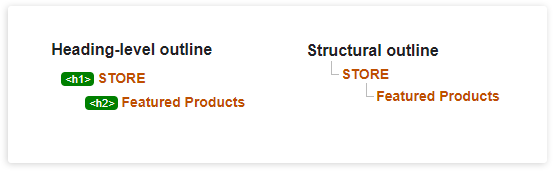

**العنصر `main`**

في هذا الدرس تطرقنا الى العنصر `main` حيث أن هذا العنصر من العناصر التقسيمية التي تتيح لنا تنظيم المستند وتقسيمة إلى أقسام منطقية.

يستخدم العنصر `main` لإحتواء المحتوى الرئيسي لجسم المستند أو لجزء محدد من المستند بحيث يكون هذا المحتوى عبارة عن العناصر الرئيسية في التطبيق.

---

### إستخدامنا للعناوين

* قمنا بإستخدام عنوان من المستوى الأول `h1` لإسم المتجر STORE حيث نعتبرة أهم عنوان في الصفحة.

* قمنا في قسم `main` بإستخدام العنوان من المستوى الثاني للعناوين الرئيسية.

**بقيامنا بذلك حصلنا على السلسلة الهرمية التالية:**
 