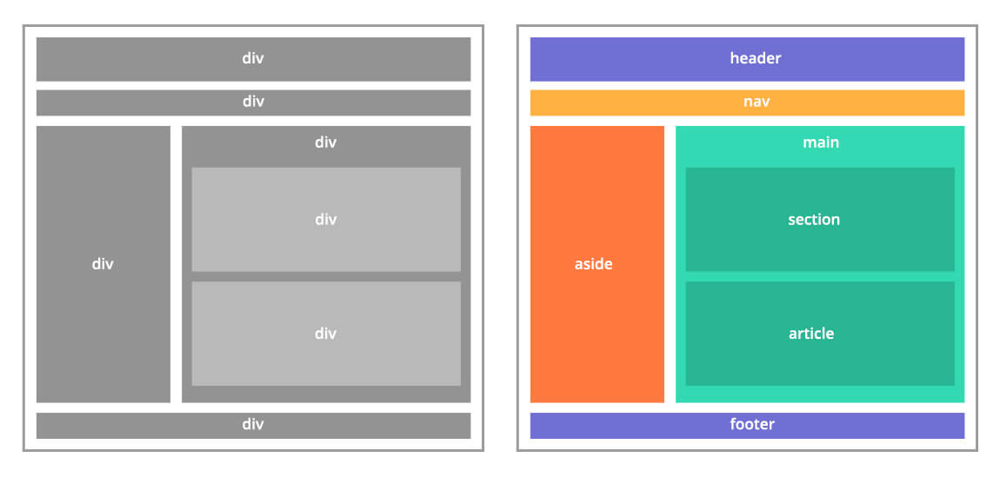

من الأن وصاعداً ستختلف رؤيتك للمواقع وستبدأ برؤية أشياء غريبة لم تعتد عليها، لا تقلق فذلك أمر طبيعي فنحن مطوري واجهات الويب نرى مالا يستطيع الأخرون رؤيته.

فما أن تقع أعيننا على تطبيق او موقع إلكتروني حتى نبدأ برؤيه صناديق وهمية في أرجاء الواجهة، دعوني أريكم الصورة التالية:


هذه الصناديق الوهمية التي نراها هي عبارة عن عناصر تقسيمية نستعملها لإنشاء تخطيط هيكلي للصفحة.

---

### العناصر التقسيمية:

حتى هذه الوحدة تطرقنا الى مجموعة من العناصر التقسيمية بعضها **دلالية** له معنى منطقي والأخر ليس له أي معنى محدد دعونا نقم بتلخيصها كالتالي:

**العنصر** `div`

عنصر غير دلالي يعمل كحاوية عامة للمحتوى الذي لا يمثل شئ معين.

**العنصر** `header`

عنصر دلالي تقسيمي يعمل كحاوية لترويسة قسم محدد او للمستند كله.

**العنصر** `main`

عنصر دلالي تقسيمي يعمل كحاوية للمحتوى الرئيسي لجسم المستند أو لجزء محدد من المستند.

**العنصر** `footer`

عنصر دلالي تقسيمي يعمل كحاوية لتذييل قسم محدد او للمستند كله.

---

### ما الذي نعنية بالعناصر الدلالية؟

هل تذكر عندما قلنا في أحد الدروس السابقة انه في الماضي كان يقوم المطورون بعمل كل أقسام الموقع بإستخدام العنصر `div` ومن ثم إسناد معرف id لهذا القسم يقوم بتمييزة عن بقية الأقسام كما في المثال التالي:

```html

<div id="header"></div>
<div id="main"></div>
<div id="footer"></div>

```

كان قيام المطورين بإسناد تلك المعرفات من أجل إستهداف كل قسم بمسمى مميز له لإعطائه تنسيقات محددة وكان من المستحيل على محركات البحث تمميز تلك الأقسام ومعرفة محتويات الصفحة بشكل صحيح ما يؤثر على ظهورها في نتائج البحث وما خلافة.

لذا مع شيوع تلك المسميات تم تقديم عناصر جديدة في إصدار لغة HTML الأخير والذي هو HTML5 بحيث أصبح بالإمكان كتابة الأكواد السابقة بالشكل التالي:

``` 

<header></header>
<main></main>
<footer></footer>

```

فأصبح لأقسام الصفحة معنى دلالي للمتصفحات و محركات البحث بحيث تستطيع تمييز أي منطقة هي منطقة رأس الصفحة وأيها منطقة المحتوى الهام والرئيسي وما خلافة..

---

### عناصر تقسيمية أخرى:

هناك المزيد من العناصر التقسيمية الأخرى سنتعرف عليها في الوقت المناسب، اليك صورة توضح إستخدام بعض تلك العناصر وطريقة تقسيمها للتطبيقات بطريقة منطقية ذات معنى في الجانب الأخر صورة توضح إستخدام العنصر `div` لعمل تقسيم لهيكلة الموقع.


