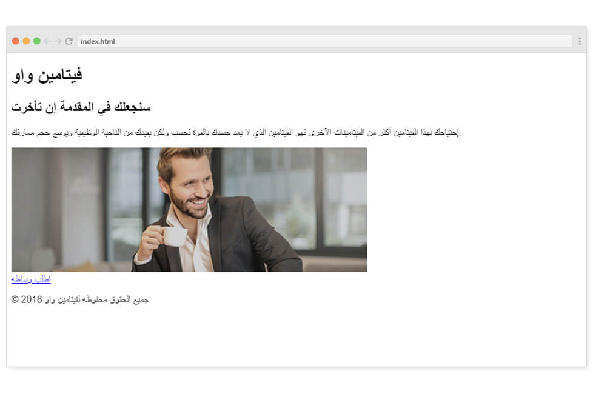

## مالذي تعرفنا عليه ؟
خلال الدروس السابقة تعرفنا على كيفية تقسيم التصميم والعمل على هيكلة الموقع بإستخدام لغة HTML

حسناً لنقم بتحدي بسيط.

## نريد تكويد تطبيق ليس لطلب وجبات أو غيره و انما لنكن أكثر إبداعاً ولنقم بعمل تطبيق لطلب وساطات :laughing:
التصميم التالي قام به مصمم الويب ودورنا هو تحويلة الى صفحة ويب تفاعلية:

 

## ماهو المطلوب منك؟
ستقوم بالعمل كما قمنا في الدروس السابقة حيث المطلوب منك التالي:

1. القاء نظرة على التصميم وتحديد الأقسام التي سنحتاج إليها.
2. تحديد العناصر التي سنقوم بإضافتها في كل قسم.
3. البدء بالعمل على كتابة الأكواد والعناصر.

## ماهي النتيجة النهائية التي يجب أن تحصل عليها؟
كما تعرف نحن في هذه المرحلة مازلنا نعمل على هيكلة الصفحات أي انه لن يكون هناك أي تنسيقات أو الوان وماخلافة وإنما مجرد العناصر الأساسية حيث يجب أن يبدو التطبيق الخاص بك بالشكل التالي:

 

## الصورة التي ستحتاج إليها 

 

قم بالضغط على الصورة بزر الماوس الأيمن وإختيار (Copy image address) أو بالعربية (نسخ عنوان الصورة) للحصول على رابط الصورة الذي ستقوم بإستخدامة في سمة الـ `src`

**ملاحظة:** بإمكانك إستخدام أي صورة أخرى لكن تذكر ان تقوم بإعطاء الصورة سمات عرض `width` وإرتفاع `height` بالأبعاد المناسبة حتى تكون مطابقة للتصميم.

## أين تقوم بكتابة الأكواد ؟ 
الدرس التالي هو عبارة عن بيئة عمل بإمكانك البدء بالعمل عليها وكتابة الأكواد الخاصة بك، قم بالإنتقال لبيئة العمل من القائمة الجانبية او من الزر التالي بعد إنتهائك من قرأة تعليمات المهمة.

<a href="#" style="display: block; width: 200px; background-color: #5355e8; background-image:linear-gradient(to left, #2d43e7, #9042e8); color:#fff; padding: 10px; margin: 30px auto; border-radius:100px; text-decoration: none; font-size: 18px; text-align: center;" target="_blank">بيئة العمل</a>

## كيف تقوم بمشاركة الكود؟
قم بمشاركة الكود الذي قمت بكتابته في منصة المجتمع على الرابط التالي:

<a href="https://forums.coretabs.net/t/مشاركة-حلول-مهمة-تطبيق-فيتامين-واو/979" style="display: block; width: 200px; background-color: #5355e8; background-image:linear-gradient(to left, #2d43e7, #9042e8); color:#fff; padding: 10px; margin: 30px auto; border-radius:100px; text-decoration: none; font-size: 18px; text-align: center;" target="_blank">مشاركة الكود</a>

اذا واجهتك أي مصاعب فكن قدها وإعرف بأن ذلك يعني بأنك وصلت إلى نقطة إكتساب مهارة ومعرفة جديدة وامامك خيارين إما الإستسلام أو تحقيق أهدافك :blush: وتذكر دائماً أن تطلب المساعدة من أعضاء مجتمعنا الرائع في أي وقت.

**تنوية: فكرة هذا التطبيق هو من باب المزاح :wink:**
