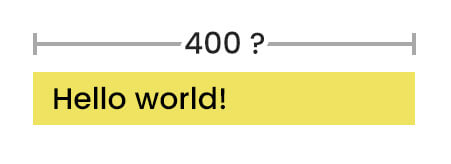
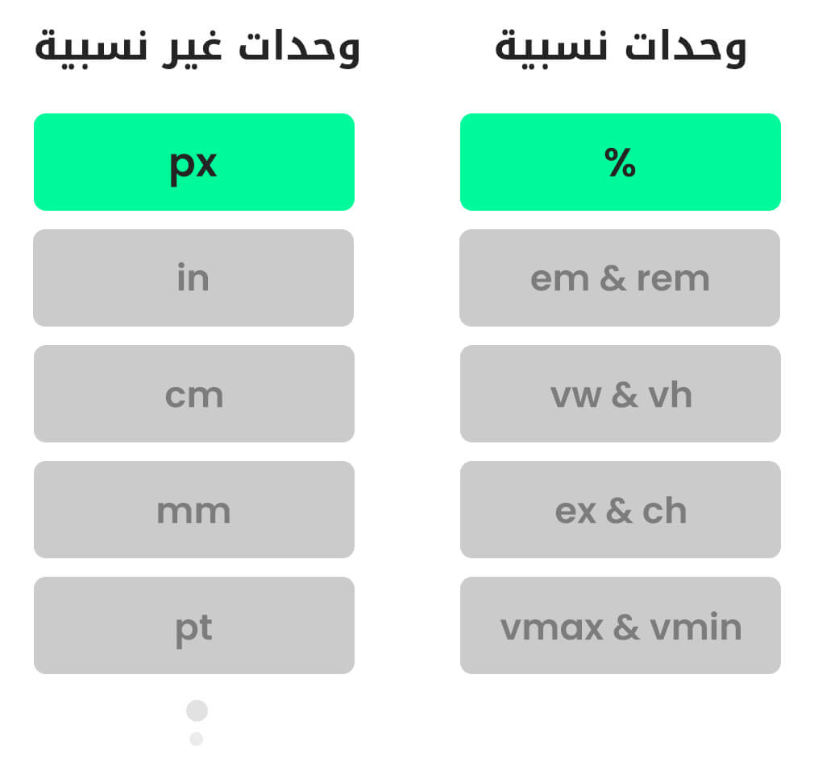
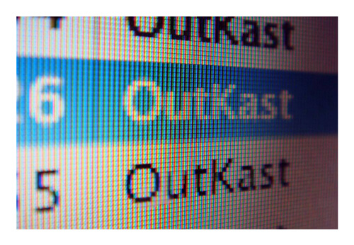
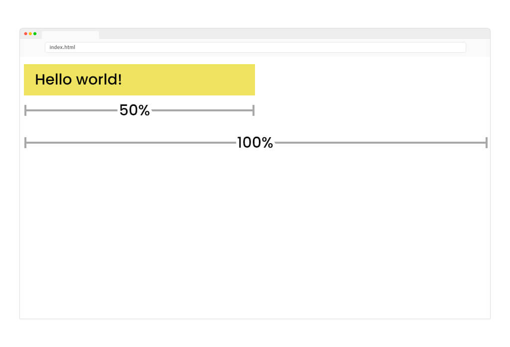

 لنلقي نظرة على هذا الصندوق لأحد منشورات الفيسبوك


نلاحظ أن هذا الصندوق لدية أبعاد محددة حيث ان عرضة = 500 وإرتفاعة = 391.

أي ان العناصر في صفحة الويب تأخذ حيزاً من المساحة بقيم محددة فاذا كان عرض وارتفاع هذا الصندوق = 0 حينها لن يكون للصندوق أي أثر.

من هنا ندرك أهمية هذه القيم و وحدات القياس لذا دعونا نناقشها في هذا الدرس.

---

### أريد أن يكون عرض العنصر بقيمة 400

لنفترض أنني قمت بإنشاء عنصر من النوع `div` كالتالي:

```
<div>Hello world!</div>
```

من ثم قمت بإعطائه عرض محدد من خلال تنسيقات الـ CSS بإستخدام الخاصية `width` والتي تحدد عرض العناصر كالتالي:
```
div{
    background-color: yellow;
    width: 400;
}
```

اذا قمت بتجربة هذا الكود ستدرك بأنه لم يتم تغييرعرض العنصر للقيمة المحددة، حيث أننا وضعنا لغة الـ CSS  في حيرة من أمرها ولسان حالها يقول:

> هيه 400 ماذا؟ هل تريد 400 سنتيمتر ام 400 بكسل ام ماذا؟


**لهذا تذكر يجب أن نقوم دائماً بالحاق هذه القيم بوحدة قياس محددة**

---

### ماهي وحدات القياس هذه؟

يوجد العديد من وحدات القياس في لغة الـ CSS ما يعطينا مرونة في تحديد القيم بما يتوافق مع التصميم الذي نعمل علية، في هذه المرحلة سنتطرق إلى وحديتن منهما فقط.



### كما لاحظت وحدات القياس نوعين

  **1- وحدات قياس غير نسبية (ثابته):** هذه الوحدات لا تعتمد على عنصر أخر لتحديد قيمتها على سبيل المثال اذا أخبرتك بأن تقوم بجعل عرض العنصر بقيمة 10 سنتيمتر فهذه الـ 10cm ستكون دائماً ثابته.

  **2- وحدات قياس نسبية:** هذه الوحدات تعتمد على عنصر أخر لتحديد قيمتها على سبيل المثال اذا أخبرتك بأن تقوم بجعل عرض العنصر بقيمة 50% فسيتبادر إلى ذهنك السؤال 

> تريد 50% من ماذا؟

فإذا أخبرتك 50% من 1000 فالقيمة هي 500 
اما اذا اخبرتك 50% من 500 فالقيمة هي 250 

لاحظ انه بالرغم من أن النسبة 50% ثابته إلا أن هناك إختلاف إعتماداً على القيمة الأخرى ولهذا سميت نسبية.

---

### الوحدة px

هل سبق وان شاهدت شاشة التلفاز او شاشة الكمبيوتر عن قرب ولاحظت وجود العديد من النقاط الصغيرة؟


هذه ما تسمى بالـ pixels والتي هي أصغر نقطة في الشاشة حيث أن الشاشة التي تشاهدها عبارة عن العديد من النقاط المتراصة و التي تشكل الصورة.

ستلاحظ هذه النقاط بشكل واضح في الشاشات التي دقتها ضعيفة اما في الشاشات التي دقتها كبيرة لا تجدها واضحة بشكل كبير حيث أن كثافة الـ pixels تكون كبيرة.

**أي أن عدد الـ  pixels يختلف من شاشة إلى أخرى**

وعلية يجب الإشارة إلى ان انه مع تطور الشاشات من يوم لأخر جعل تعريف الـ pixel يتطور كذلك فالوحدة px في لغة الـ CSS أصبحت تجريدية أي انها لم تعد تشير إلى نقطة واحدة في الشاشة، سنتطرق لهذه التفاصيل في الوقت المناسب.

### مثال:
لنعد للـ div الذي قمنا بإنشائه سابقاً ونقوم بإعطائة عرض بقيمة 400 لكن هذه المرة بالبيكسل كالتالي:

```
div{
    background-color: yellow;
    width: 400px;
}
```

قم بتجربة الكود وستجد أنه يعمل بشكل رائع هذه المرة!

**تذكر:** الوحدة px هي وحدة غير نسبية أي انها ثابته لا تتأثر بأي عوامل أخرى.

---

### الوحدة %

لنلقي نظرة على هذا الكود 
```
<body>
    <div>Hello world!</div>
</body>
```

```
div{
    background-color: yellow;
    width: 50%;
}
```

قمت بتحديد عرض الـ div بـ 50%.

 **لكن 50% من ماذا؟**

ستقوم لغة الـ  CSS بالنظر لمن هو الأب لهذا العنصر وتقوم بإعطائة عرض بقيمة 50% من عرض الأب.

في حالتنا الأب الخاص بهذا العنصر هو العنصر body أي ان العنصر div سيأخذ نصف عرض الـ body.



نلاحظ ان عرض الـ div يعتمد على عرض الـ body فمهما كان عرض الـ body فسيأخذ الـ div نصف حجمة.

**تذكر:**الوحدة % هي وحدة نسبية تتأثر بالعنصر الأب.
