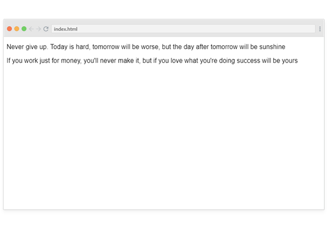
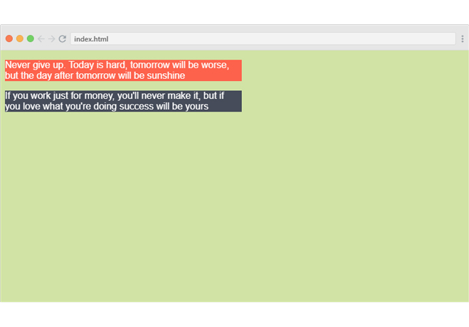

حان الوقت لتطلق العنان لإبداعك :sunglasses:

## ماهي معطيات مهمة اليوم؟

في الدرس التالي ستجد بيئة العمل التي تحتوي على فقرتين نصيتين بالهيكلة التالية:

```html
<p>
    Never give up. Today is hard, tomorrow will be worse,
    but the day after tomorrow will be sunshine
</p>
            
<div>
     <p>
         If you work just for money, you'll never make it, but if you
         love what you're doing success will be yours
     </p>
</div>
```

**والنتيجة على متصفح الإنترنت كالتالي:**

 


## ماهو المطلوب منك؟

ستقوم بإستهداف عناصر الصفحة وإعطائها التنسيقات اللازمة بما يتحقق مع الشروط التالية:

- عرض الفقرات النصية محدد بقيمة 400px

- إعطاء جسم الصفحة لون للخلفية.

- كل فقرة نصية لها لون خلفية مختلف عن الأخر.

- لون الخط في كل فقرة نصية يعتمد على لون الخلفية الذي قمت بإختيارة.

(فمثلاً اذا كانت لون الخلفية غامقة فيجب أن يكون لون الخط فاتح والعكس صحيح)

 
**ماهي الألوان المطلوبة؟**
الباب مفتوح لك في إختيار الألوان على ذوقك.

بإمكانك الإستفادة من المصادر التالية لإختيار الألوان:
[https://htmlcolorcodes.com/color-picker](https://htmlcolorcodes.com/color-picker)
[https://htmlcolorcodes.com/color-names/](https://htmlcolorcodes.com/color-names/)
[https://www.instagram.com/colours.cafe/?hl=en](https://www.instagram.com/colours.cafe/?hl=en)


## كيف ستبدو النتيجة النهائية؟

أدناة هو تطبقي لهذه المهمة، تطبيقك قد يبدو مختلف من ناحية الألوان 
 

## أين تقوم بكتابة الأكواد؟ 

الدرس التالي هو عبارة عن بيئة عمل تحتوي على أكواد لغة الـ HTML حيث ستقوم بالبدء بالعمل مباشرة على التنسيقات بلغة الـ CSS، قم بالإنتقال لبيئة العمل من القائمة الجانبية او من الزر التالي بعد إنتهائك من قرأة تعليمات المهمة.

<a href="https://coretabs.net/classroom/frontend/html-css-basics/البدأية-مع-لغة-التنسيقات-CSS/بيئة-عمل-مهمة-التدرب-على-لغة-التنسيقات" style="display: block; width: 200px; background-color: #5355e8; background-image:linear-gradient(to left, #2d43e7, #9042e8); color:#fff; padding: 10px; margin: 30px auto; border-radius:100px; text-decoration: none; font-size: 18px; text-align: center;" target="_blank">بيئة العمل</a>

## كيف تقوم بمشاركة الكود؟ 

قم بمشاركة الأكواد التي قمت بكتابتها في منصة المجتمع على الرابط التالي
<a href="https://forums.coretabs.net/t/مشاركة-حلول-مهمة-التدرب-على-لغة-التنسيقات/1377" style="display: block; width: 200px; background-color: #5355e8; background-image:linear-gradient(to left, #2d43e7, #9042e8); color:#fff; padding: 10px; margin: 30px auto; border-radius:100px; text-decoration: none; font-size: 18px; text-align: center;" target="_blank">مشاركة الكود</a>


 ---

في حال واجهتك مشكلة او تحتاج إلى أي مساعدة بإمكانك الرجوع دائماً لمنصة مجتمعنا [من هنا](https://forums.coretabs.net.) وستجدنا جميعاً مستعدين لمساعدتك!
