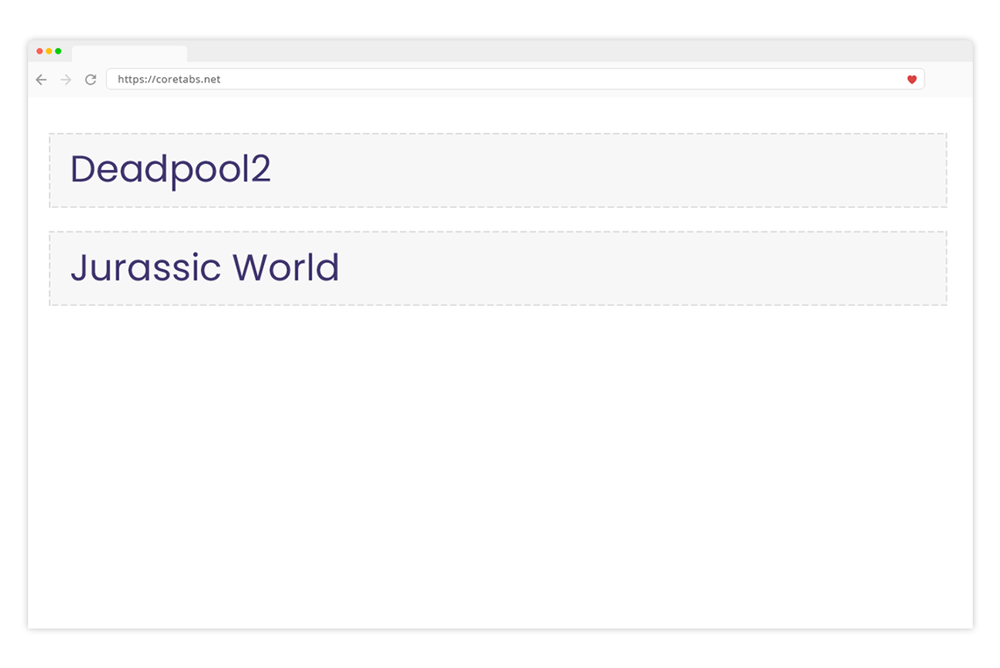
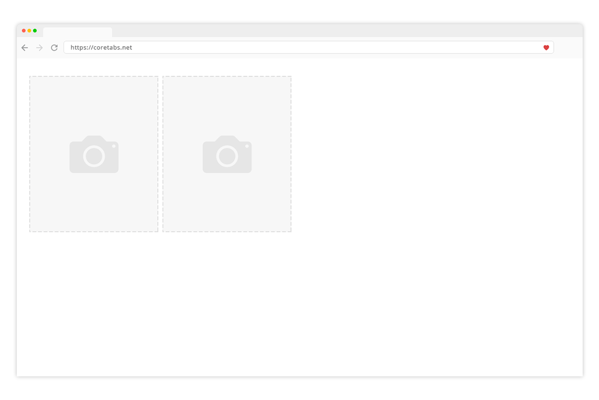

مستند الـ HTML يتكون من العديد من العناصر التي نعتبرها كوحدات البناء لصفحة الويب وكل عنصر لدية طريقة عرض افتراضية إعتماداً على نوعة فإما أن يكون العنصر من نوع block او من نوع inline.

 

## عناصر نوع Block:
هذه العناصر بإمكانك تخيلها كصندوق عند وضعة على صفحتك فسوف يأخذ مساحة العرض كاملة مما يعني أنه لا يقبل بأن يشاركة أي عنصر أخر بنفس السطر.

**كما لاحظنا في الفيديو مع عناصر العنوان `<h2>` وكيف تم عرض كل عنصر في سطر منفصل كما في الصورة التالية:**
 

## عناصر نوع Inline:
بعكس العناصر من نوع Block هذه العناصر تشارك بعضها المساحة ولا تأخذ العرض كامل وبإمكانك إدراج أكثر من عنصر بجوار بعضها البعض.

**كما لاحظنا في الفيديو مع عناصر الصور `` وكيف تم عرضها بجوار بعضها البعض كما في الصورة التالية:**
 
v

## في الختام تذكر التالي:
لا يجب عليك أن تحفظ أي العناصر هي block وايها inline بل أن تفهم الفكرة ومع الوقت و الممارسة ستستطيع تحديد ذلك كونك قد سبق وأستخدمت العنصر الفلاني وتعرف طريقة عرضة وعملة.

## مهمة اليوم: 
كن مستعداً للإجابة عن الإختبار التالي بالعودة لبيئة العمل أعلاة وتجربة بقية العناصر وقم بتحديد أي منها من النوع  Block وأي منها من النوع inline

- العنصر ``
- العنصر `

`
- العنصر `

`
- العنصر `<strong></strong>`
- العنصر `<h1></h1>`
- العنصر ``

