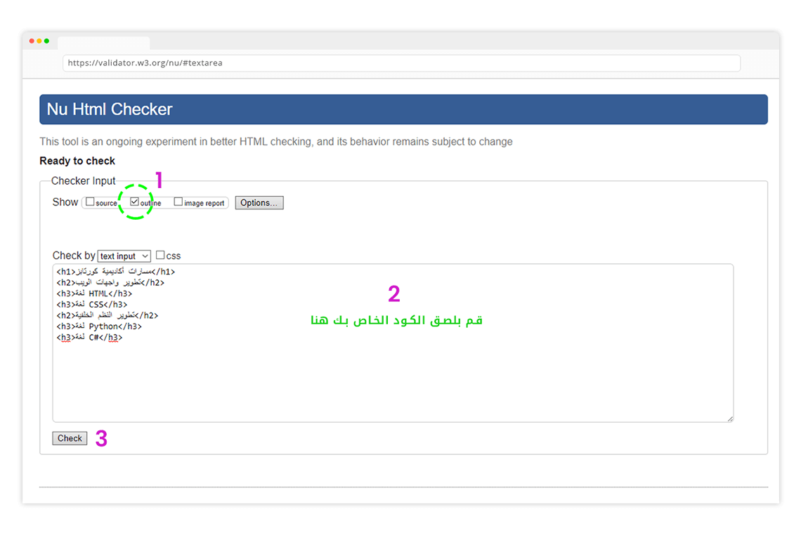
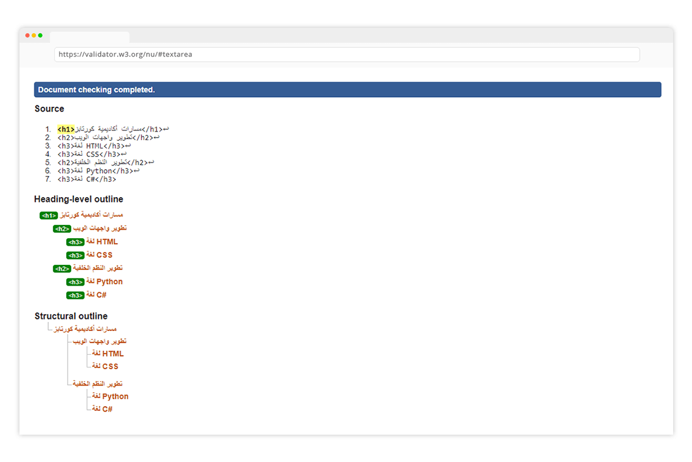

### فحص تسلس عناوين الصفحة:

بإمكانك القيام بذلك من خلال الموقع التالي
https://validator.w3.org/nu/#textarea

1. قم بإختيار outline 
2. قم بلصق الكود الخاص بك
3. قم بالضغط على زر check

 

بعد ذلك قم بالنزول لأسفل الصفحة وستجد النتيجة

 

